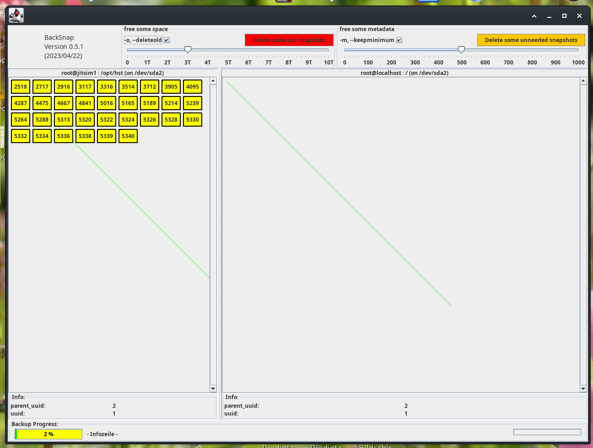
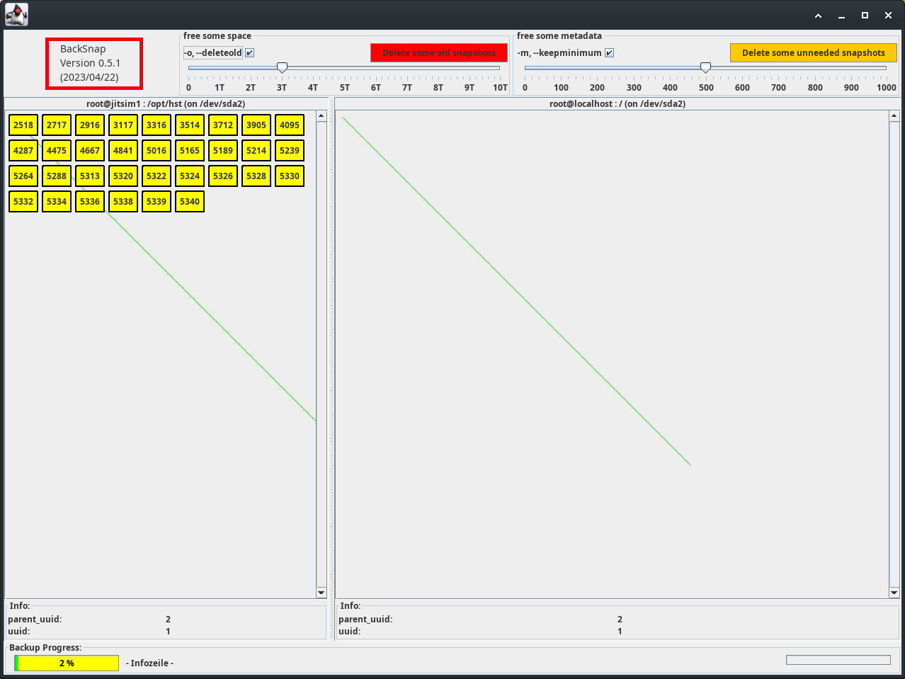
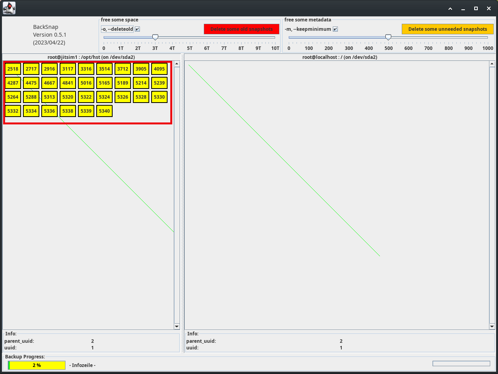
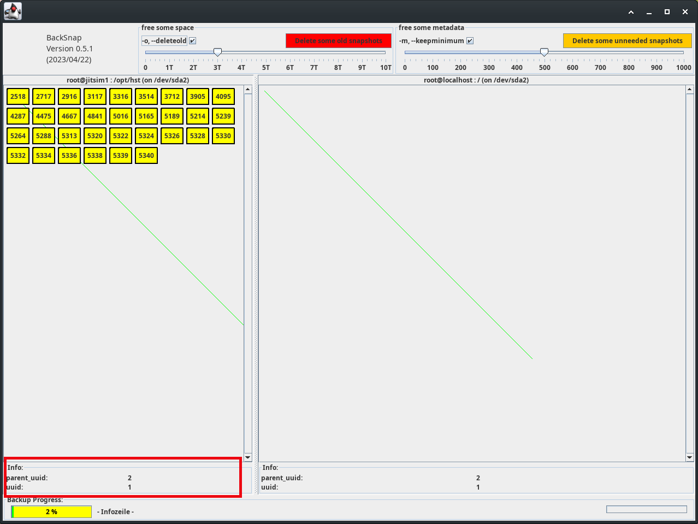
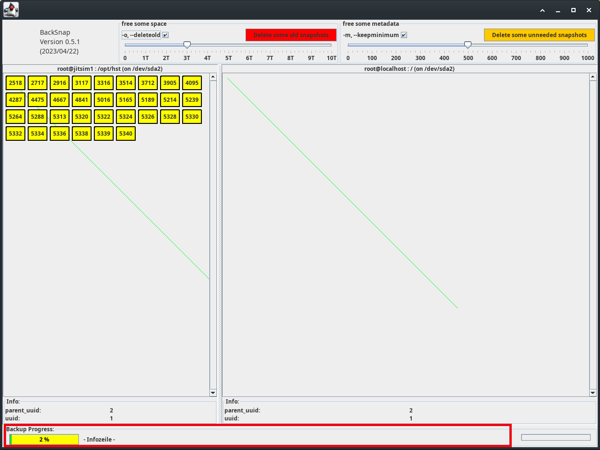
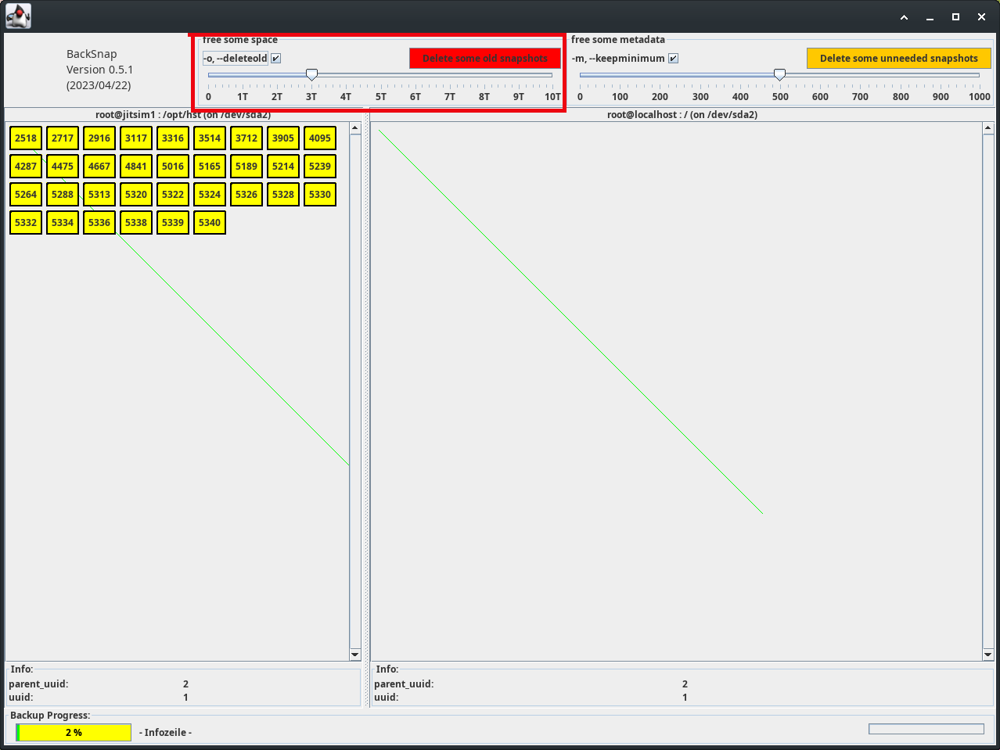
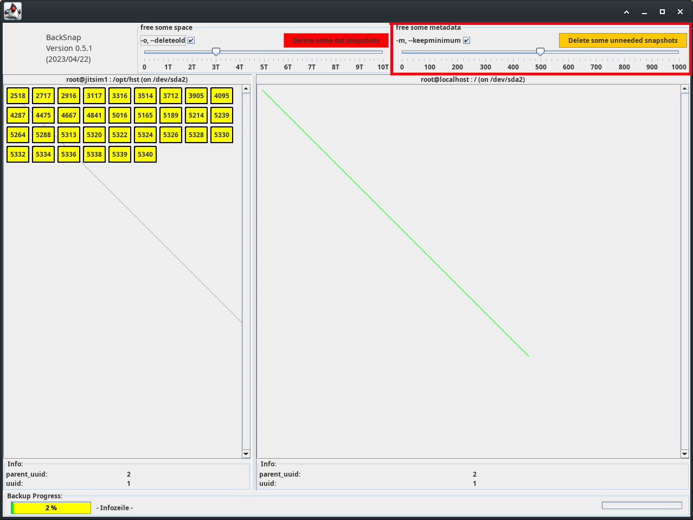

Sonntag, 14. Mai 2023 03:07 
# HowTo

## de
#### [Installation](install_de.md) 
#### [Backupmedium vorbereiten](device_de.md)
#### ~~[CLI ausprobieren](clitest_de.md)~~
#### ~~CLI automatisieren~~
#### ~~[GUI testen](guitest_de.md)~~
#### ~~GUI per script~~
####  ~~[ssh einsetzen](ssh_de.md)~~
#### [Restore vom Backup](restore_de.md)

## en

## pictures
{width=50% height=50%}
#### version
{width=50% height=50%}

#### snapshots
{width=50% height=50%} {width=50% height=50%}

#### Info (mouse over)
{width=50% height=50%}

#### progress
{width=50% height=50%}

#### backup
-

#### maintenance
{width=50% height=50%}
{width=50% height=50%}