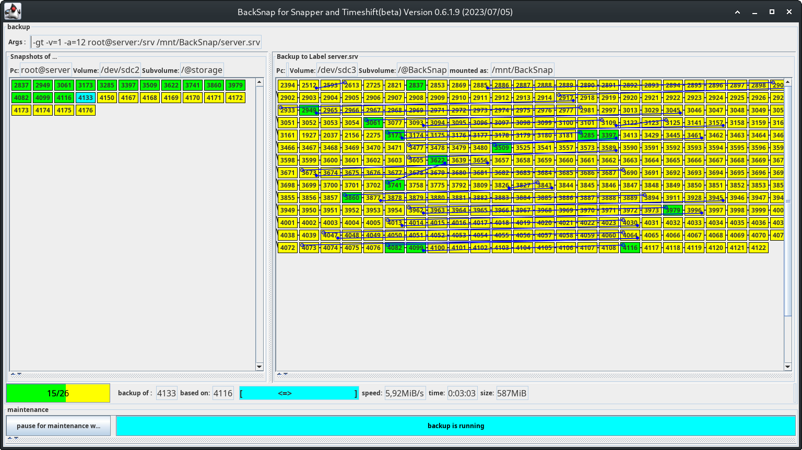

Sonntag, 14. Mai 2023 15:07 
# HowTo

## de
#### [Installation](install_de.md) 
#### [Backupmedium vorbereiten](device_de.md)
#### [CLI ausprobieren](clitest_de.md)
#### [CLI per script](backup_de.md)
#### ~~[GUI testen](guitest_de.md)~~
#### [GUI per script](backup_de.md)
####  [ssh einsetzen](backup_de.md)
#### [Restore vom Backup](restore_de.md)
Sie finden mich im [manjaro-forum](https://forum.manjaro.org/t/howto-hilfsprogramm-fur-backup-btrfs-snapshots-mit-send-recieve/130154) als "andreas85"

## en
#### [Install](install_en.md)
#### [Prepare backup medium](device_en.md)
#### [Try the CLI](clitest_en.md)
#### [CLI by script](backup_en.md)
#### ~~[Test GUI](guitest_en.md)~~
#### [GUI by script](backup_en.md)
#### [use it with ssh](backup_en.md)
#### [Restore from backup](restore_en.md)
You can find me in the [manjaro-forum](https://forum.manjaro.org/t/howto-hilfsprogramm-fur-backup-btrfs-snapshots-mit-send-recieve/130154) as "andreas85"
## pictures
Some screenshois of BackSnap in action:
##### Timeshift:

##### Snapper:

#### version
Shows the version, and all parameters that where supplied

#### snapshots
* On top: Where do we get the Snapshots from ?
* Every Snapshot is showed with a "name"

 

* Yellow: snapshot is present, but no backup of it
* Cyan: Backup is in progress 
* Green: Backup is already present

#### Info (mouse over on snapshot)
If you move your mouse over an snapshot, some details of this snapshot will be shown

#### progress
While doing backups this line shows the progress

#### backup
* On top: Where do we put the backups of the snapshots  ?
* Every Bnapshot is showed with a "name"

* Green: Backup of an existing snapshot
* Yellow: Backup of a nonexisting snapshot
* Cyan: Backup is in progress
Backups that build on each other are visually connected by a black line

#### maintenance
##### free some space
Remove some old backups of snapshots that are no longer in use. 
* You select how **old** a backup has to be, to be marked 
* The old backups are marked red.
* By pressing the button you remove them

##### free some metadata
Remove some intermediate backups of snapshots that are no longer in use.
* You decide how many backups to **keep** at least
* The sugested backups are marked orange
* You can select / deselect others instead with the mouse
* By pressing the button you remove them

 
 

##### scrub
 -
##### balance
 -