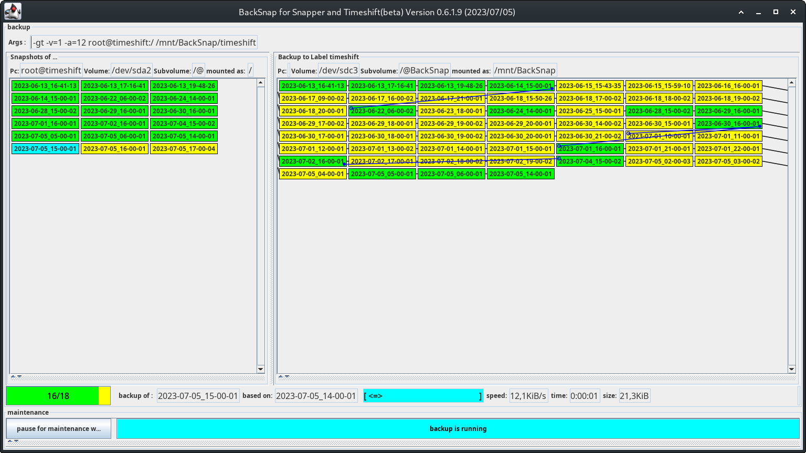

# How to use BackSnap

### [Install backsnap en ->](./gallery/install_en.md)
### [Install backsnap de ->](./gallery/install_de.md)

#### or [HowTo] Backup btrfs snapshots with send/receive

* This a Rework with somme **cached** commands
* It works with **Snapper** and **Timeshift.**
* It uses **btrfs compression** with send/receive 
* It uses configfiles in `/etc/backsnap/*.conf`.

With BackSnap, regular backups for btrfs are no longer a burden, but an easy task.

## Goals of BackSnap:
**Simple external backup** of complete (btrfs) subvolumes

* Back up **all** snapshots
* **Differential backup** of each snapshot (fast). If the backup is repeated after a few days/weeks/months
* As **little space consumption** on the backup medium as possible
* The backup medium can be used for **backups of different computers**
* Command line program without GUI
* KISS
* GUI with -g clear representation of snapshots and existing backups
* Assisted configuration with -gi
* GUI controlled deletion of outdated backups
* GUI controlled pruning of backups

##### No Goal:
* No automatic management of backups by age
* No automatically delete old backups when there is not enough space
* No backup of the current state (this minute) of a subvolume

##### Desirable side effects
* The **backup strategy** is already defined in snapper or timeshift, and is involved here
* The backup is compressed, but at the same time all snapshots in the backup are **always fully read-only accessible**

## Requirements:
* **Java 21** on the computer 
* Recommended: **pv** installed
* BTRFS both on the computer (recommended as **RAID 1** with 2 devices) and on the backup medium (single)
* **snapper**-layout of the snapshots or **timeshift**-layout
* Recommended: external backup medium e.g. USB3 hard drive

# BackSnap:
The Java program BackSnap backs up ALL snapshots from a specified directory to another directory on a backup medium. 
To do this, it uses **btrfs send** and **btrfs receive**.
You can use backsnap without any configuration as cli-programm, or you can create your configuration in `/etc/backsnap.d/*.conf` . Working with configfiles in /etc is way faster ;-)

### With configuration in `/etc/backsnap.d/`
You only need to start backsnap in a terminal. It will look for configuration and flags in `/etc/backsnap.d/` 
In a terminal: `sudo backsnap -gc -v=5 -a=5` 
This is **way faster** then calling backsnap for each pc or subvolume, because the backup-disk will only be mounted once.

### Without configuration
##### Source (snapshots)
The 1st passed parameter points to the **SOURCE path** where the snapshots are reachable by Snapper. Snapper creates all snapshots in directories with ascending numbering. The actual snapshot there is simply called "snapshot".

* **/**
* **/home**
* /.snapshots (alternative)
* /home/.snapshots (alternative)

##### Destination (backups)
The 2nd parameter points to the **DESTINATION path** at which the snapshots are to be saved. To do this, the **backup medium** must be mounted before the program is called. A backup subvolume named **/@BackSnap** and a directory with individual Names for each subvolume of each PC are suggested. The path to this mounted directory will be specified as the **TARGET path** for the backup.

* **/mnt/BackSnap/manjaro21**
* **/mnt/BackSnap/manjaro21.home** 

Backsnap goes through all the directories in the source path in **ascending time order** and checks if that respective directory already exists at the destination. If not, the snapshot will be saved there. 

If possible, a previous snapshot is used as **"parent"**.

Each time the program is called, all snapshots of ONE subvolume can be backed up, which corresponds to ONE configuration of Snapper or Timeshift.

## Furter reading:
### [Install backsnap en ->](./gallery/install_en.md)
### [Install backsnap de ->](./gallery/install_de)

## Afterword
###### A snapshot is not a backup!

I've read that before. Basically true, but a BTRFS snapshot is **as good as any other system internal backup**.
Btrfs can provide home users with a high level of security against data loss.
With a little additional effort, external backup for BTRFS can also be implemented. Then a 3-2-1 backup with Btrfs is possible without any problems

#### The responsibility for backups never lies with a program, but always with the user!

##### In-system backup (n-snapshots 1)
Btrfs with RAID0 and **read-only snapshots** via Snapper (or Timeshift) are like a backup of the original files stored in the same system. It protects against:
* minor problems, such as accidentally deleting a file
* delete an entire file tree (e.g. /home/hans/* )
* by unintentionally changing the file permissions of many files
* unintentionally changed files

##### In-system backup with RAID (+1)
Running btrfs with "RAID1" on at least two different devices is as good as **local backup**.
This also protects against:
* Failure of a complete device
* File system corruption on a device
* Loss of partition table on a device
* overwrite a device with dd ;-)

##### Out-of-system backup (+1)
If the snapshots are also backed up to an external hard drive, it is another TRUE **external backup**.
Ideally, the external hard drive should only be connected to the computer for a short period of time. This also protects against:
* Complete computer failure
* Loss of previous backups up to the capacity of the external hard drive
* Targeted deletion of internal backups (e.g. by mallware)

Btrfs then corresponds to 3-2-1 Backup (Near CDP)

----

Sonntag, 29. Oktober 2023 17:45 
